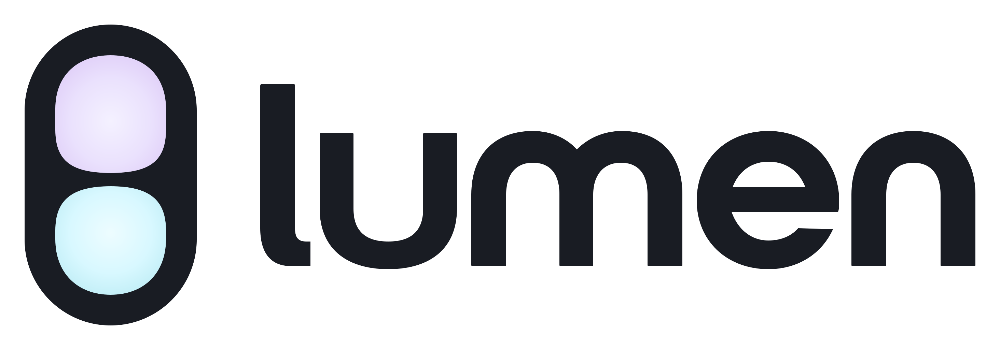
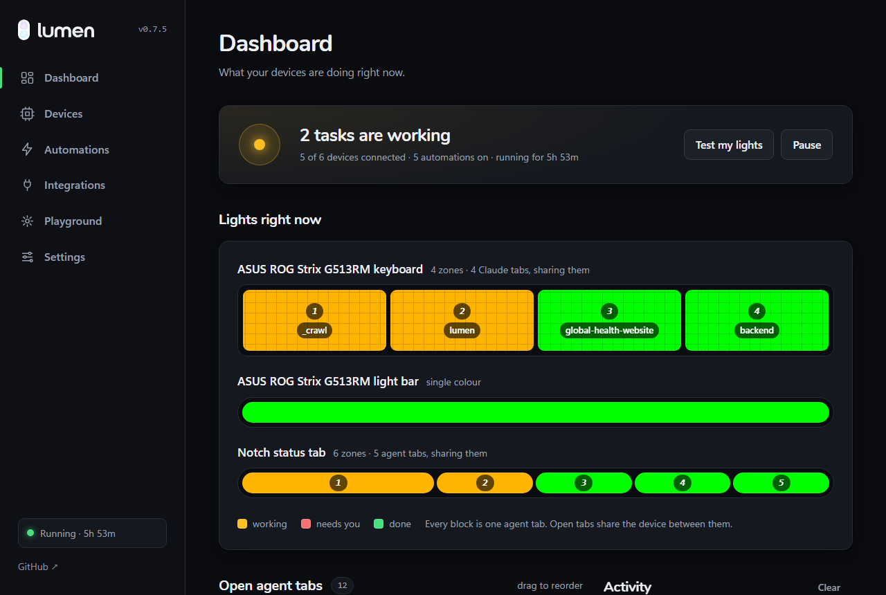
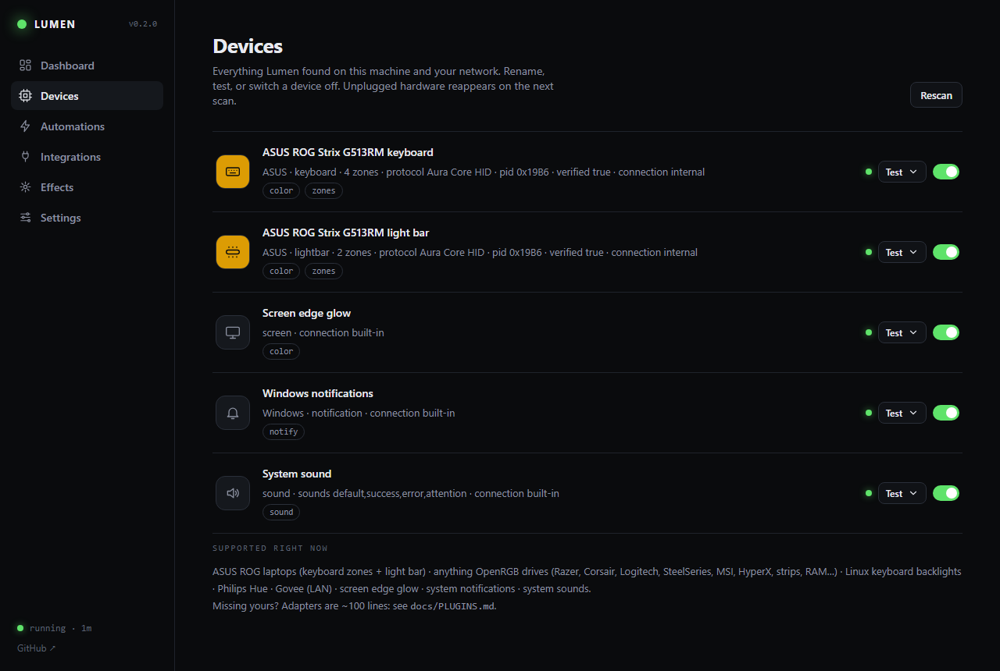
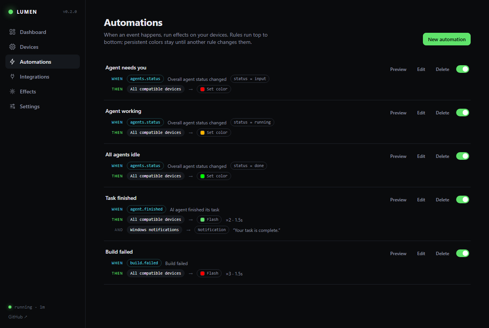
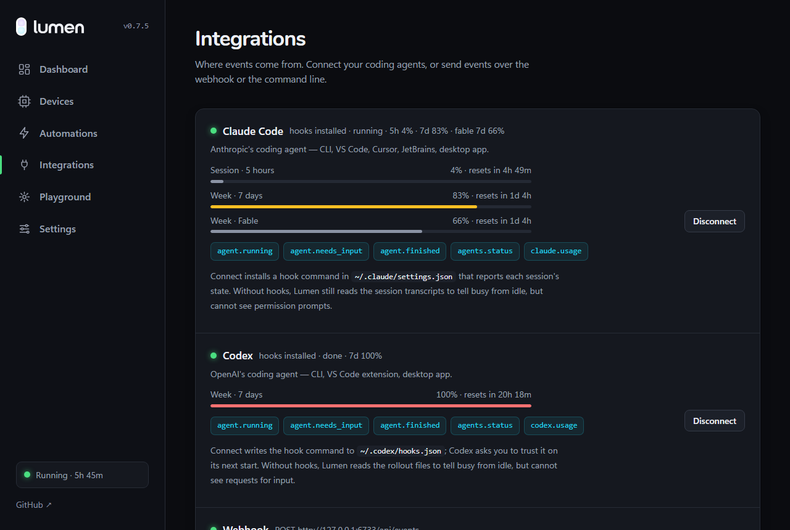

<p align="center">
  <picture>
    <source media="(prefers-color-scheme: dark)" srcset="docs/brand/png/lumen-logo-white.png">
    <source media="(prefers-color-scheme: light)" srcset="docs/brand/png/lumen-logo.png">
    
  </picture>
</p>

<p align="center"><strong>Something happens on your computer → the devices around you react.</strong></p>

<p align="center">
  <a href="https://github.com/Brxerq/lumen/releases/latest"></a>
  <a href="LICENSE"></a>
  
  
</p>

Lumen is a universal device-feedback layer for developers. Your AI coding agent finishes a task, a build fails, a deploy lands, a long command ends — and your keyboard flashes, your light bar changes color, your smart lights pulse, your screen edge glows, or you simply get a notification and a sound. Whatever hardware you have, Lumen finds the best way to tell you.

<p align="center">
  
</p>

- **Automatic device detection** — plug in, scan, done. RGB keyboards, light bars, strips, smart lights, laptop backlights, plus the screen, notification center and speaker every machine already has.
- **A status tab at the top of the screen** — a small always-on-top notch on Windows, macOS and Linux: one bar per open Claude or Codex tab in its status colour, filling as that tab's context window does. Hover to unfold it, click a row to focus that terminal, drag it to any edge, double-click to pin, hide it when idle.
- **Knows what each tab is doing** — activity ("Editing api.py", "Asking you"), context-window use and session cost per tab, plus your Claude and Codex 5-hour, 7-day and per-model limits read from the login your agent already holds, with reset countdowns and burn rate. All of it is on the tab, the dashboard, and in the rule builder (`five_hour_used >= 90`).
- **Works without RGB** — a MacBook or a plain laptop still gets a screen glow, a system notification and a sound.
- **Event-driven automations** — `WHEN agent.finished THEN keyboard → flash green ×2 AND notification`. A visual rule builder, no config files.
- **Integrations** — Claude Code, Codex, GitHub Actions, any shell command, timers, and a local webhook for everything else.
- **Plugin architecture** — a device adapter or an integration is one small Python module. Contributors never touch the core.
- **Polished, local, private** — a tray daemon with a fast web dashboard on `127.0.0.1`. No accounts, no cloud, no telemetry: the dashboard loads nothing from the internet, fonts included.

## Install

**macOS and Linux**

```bash
curl -fsSL https://brxerq.github.io/lumen/install.sh | sh
```

**Windows** (PowerShell)

```powershell
irm https://brxerq.github.io/lumen/install.ps1 | iex
```

Then run `lumen`. Both lines fetch the standalone build for your platform from the
[latest release](https://github.com/Brxerq/lumen/releases/latest), check it against the
published SHA-256, and put it on your PATH — no Python, no toolchain. After that Lumen
updates itself from **Settings → About**. You can also download the binary by hand from
the releases page.

<details>
<summary>From source (Python 3.11+)</summary>

```bash
pip install git+https://github.com/Brxerq/lumen
lumen
```

Or from a clone, for development (see [docs/DEVELOPMENT.md](docs/DEVELOPMENT.md)):

```bash
git clone https://github.com/Brxerq/lumen lumen && cd lumen
pip install -e .
lumen
```

`pip install --upgrade git+https://github.com/Brxerq/lumen` re-resolves from this repository.

> Install from this repository, not from PyPI: the name `lumen` there belongs to an
> unrelated project.

</details>

The first run opens the dashboard at <http://127.0.0.1:6733> and walks you through it: scan for hardware, test each device, connect your agents, choose what happens when a task finishes, fire a test. Enable **Start at login** in Settings and forget about it — Lumen lives in the tray.

## What it looks like

| Devices | Automations |
|---|---|
|  |  |

| Integrations — both agents' limits, resets and events |
|---|
|  |

## Supported devices

| Device | Adapter | Capabilities | Notes |
|---|---|---|---|
| ASUS Aura laptops — ROG, TUF, Zephyrus (keyboard zones + light bar) | `asus_aura` | color, zones | Raw HID, no vendor software. Verified on ROG Strix G513RM; other Aura Core models are detected and marked unverified. |
| Most other RGB laptops and boards — Razer, Corsair, Logitech, SteelSeries, MSI, HyperX, ASUS Aura, Gigabyte, RAM, strips, fans… | `openrgb` | color, zones (per-key wave on keyboards) | Anything [OpenRGB](https://openrgb.org) drives. Install OpenRGB and enable its SDK server; Lumen launches it if needed. |
| Linux laptop keyboard backlights | `linux_backlight` | brightness | `/sys/class/leds/*kbd_backlight*`. Pulses/blinks brightness. |
| MacBook keyboard backlight | `mac_backlight` | brightness | Private CoreBrightness framework, no helper to install. Apple Silicon and Intel. Pulses/blinks brightness. |
| Philips Hue | `hue` | color, brightness | Bridge found automatically; pair from the Devices page. Restores the previous light state after an effect. |
| Govee lights | `govee` | color, brightness | LAN API (enable *LAN Control* in the Govee app). No cloud key. |
| Screen edge glow | `screen` | color | Thin always-on-top border on any OS. Transient effects only unless targeted explicitly. |
| Notch status tab | `notch` | color, zones | Dark tab hanging from the top of the screen; one lit bar per open agent tab that fills with its context window, plus your Claude and Codex 5-hour / 7-day usage; hover for details, click a row to jump to that terminal. Hidden when idle or during full-screen apps; position and on/off in Settings. |
| System notifications | `notification` | notify | Windows toast, macOS notification center, `notify-send`. |
| System sounds | `sound` | sound | Eight tones — chime, blip, knock, descend, bell, ping, fanfare, alert — synthesised on first use, so every platform sounds the same and nothing is licensed from anyone. Pick one per automation; the slider on the Devices page is the volume. |

Effects degrade gracefully: a `flash` on a brightness-only backlight becomes a blink, `wave` on a single-zone light becomes a pulse. The rule builder only offers what a device can do.

Want your hardware here? See [docs/PLUGINS.md](docs/PLUGINS.md) — most adapters are under 100 lines — or open a [device request](.github/ISSUE_TEMPLATE/device_request.yml).

## Integrations (where events come from)

| Source | How | Events |
|---|---|---|
| **Claude Code** (CLI, VS Code, Cursor, JetBrains, desktop) | One-click hook install, plus a hook-free transcript fallback | `agent.running`, `agent.needs_input`, `agent.finished`, `agents.status`, `agents.sessions` (the open tabs share the keyboard zones), `claude.usage` (5-hour, 7-day and per-model limits) |
| **Codex** (CLI, VS Code, desktop) | Hook install + rollout fallback | same, plus `codex.usage` |
| **GitHub Actions** | Polls `gh run list` for the repos you choose | `github.workflow.succeeded` / `.failed` |
| **Terminal & scripts** | `lumen exec -- <cmd>`, `lumen emit <type>`, `lumen timer 25m`, shell snippet for slow commands | `command.*`, `timer.finished`, anything |
| **Webhook** | `POST /api/events {"type": "build.failed"}` | anything |

```bash
lumen exec -- npm run build          # command.succeeded / command.failed
lumen emit deploy.succeeded --data name=api
lumen timer 25m --name pomodoro
curl -X POST localhost:6733/api/events -d '{"type":"build.failed","data":{"name":"web"}}'
```

## Automations

Rules are `WHEN` an event (optionally filtered on its data) `THEN` one or more actions. Actions are an effect on a device or on *all compatible devices*:

| Effect | Needs | Persistent? |
|---|---|---|
| Set color / Turn off | color | yes — stays until another rule changes it |
| Flash, Pulse | color | no — plays for a few seconds, then the base color returns |
| Wave | zones | no |
| Pulse / Blink brightness | brightness | no |
| Notification | notify | — |
| Sound | sound | — |

The defaults mirror your agents' overall status (red = waiting for you, amber = working, green = idle), flash green twice when a task finishes, and flash red when a build fails. **Reduce flashing** in Settings turns every flash into a smooth pulse no faster than 2 Hz.

## Command line

```
lumen                       run the daemon (tray icon + dashboard)
lumen run --no-tray         same, in the foreground
lumen scan                  list detected devices
lumen test <device> [effect] [#rrggbb]
lumen emit <type> [--data k=v]
lumen exec -- <command>
lumen timer 25m [--name x]
lumen connect claude|codex  install agent hooks (disconnect to remove)
lumen autostart on|off
lumen open                  open the dashboard
```

## How it works

```
integrations ──emit──▶ EventBus ──▶ rules ──▶ EffectPlayer ──▶ devices
   claude, codex,         │                      │               asus_aura, openrgb, hue,
   github, terminal,      └── activity log       └── base color + transient effects,
   webhook                                           30 fps, writes only on change
```

Read [docs/ARCHITECTURE.md](docs/ARCHITECTURE.md) for the full picture and [docs/API.md](docs/API.md) for the local HTTP API the dashboard uses.

## Contributing

Issues and pull requests are welcome — see [CONTRIBUTING.md](CONTRIBUTING.md), the [roadmap](docs/ROADMAP.md) and the [plugin guide](docs/PLUGINS.md). Good first contributions: a device adapter for hardware you own, a new integration, or a screenshot from a setup we haven't seen.

```bash
pip install -e ".[dev]"
pytest
```

## Credits & license

MIT licensed — see [LICENSE](LICENSE).
